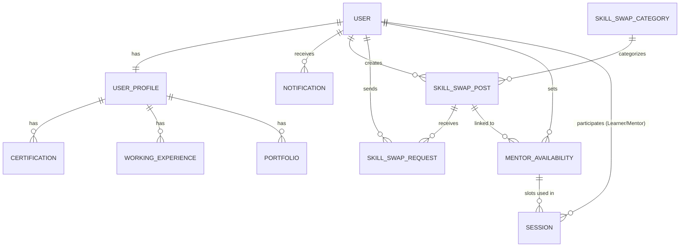

# SkillSwap - Unified Project Documentation & Defense Materials

This document consolidates the project overview, technical architecture, database design, and presentation content for the SkillSwap project.

---

## 🌟 1. Project Overview
SkillSwap is a peer-to-peer platform designed for knowledge sharing and skill exchange. Users can offer their expertise (Mentor role) in exchange for points, which they can then use to learn new skills from others (Learner role). The platform features real-time notifications, a robust points management system, and structured session scheduling.

### Key Features
- **Skill Swap Marketplace**: Discover and book sessions based on available mentor slots.
- **Point Economy**: Earn, hold, and trade points for learning opportunities.
- **Push Notifications**: Real-time alerts for booking updates, rewards, and system messages.
- **Profile Excellence**: Showcase skills, certifications, and portfolios to build trust.
- **Automated Operations**: Backend crons ensure the ecosystem remains healthy by cleaning up stale sessions.

---

## 🛠 2. Technology Stack

### Frontend (Mobile App)
- **Framework**: [Flutter](https://flutter.dev/) `3.38.5`
- **Language**: [Dart](https://dart.dev/) `3.10.4`
- **Architecture**: Feature-first Architecture
- **State Management**: [Flutter Bloc](https://pub.dev/packages/flutter_bloc) & Cubit
- **Dependency Injection**: [GetIt](https://pub.dev/packages/get_it)
- **Navigation**: [GoRouter](https://pub.dev/packages/go_router)
- **API Communication**: [Dio](https://pub.dev/packages/dio)
- **Local Storage**: [Shared Preferences](https://pub.dev/packages/shared_preferences) & [Flutter Secure Storage](https://pub.dev/packages/flutter_secure_storage)
- **Real-time Notifications**: [Firebase Cloud Messaging (FCM)](https://firebase.google.com/docs/cloud-messaging)
- **Payment Gateway**: [Khalti](https://khalti.com/)

### Backend (Server)
- **Framework**: [Django](https://www.djangoproject.com/) `5.2.11`
- **Language**: [Python](https://www.python.org/) `3.13`
- **API Framework**: [Django REST Framework (DRF)](https://www.django-rest-framework.org/)
- **Database**: [MySQL](https://www.mysql.com/)
- **ORM**: Django Native ORM
- **Admin Interface**: [Django Jazzmin](https://github.com/farridav/django-jazzmin) `3.0.2`
- **Push Notifications Server**: Firebase Admin SDK

---

## 🏗 3. System Architecture

### 📂 Backend Folder Structure
```text
backend/skillswap/
├── manage.py
├── skillswap/          # Project configuration (settings, wsgi, asgi)
└── myapp/              # Main application logic
    ├── management/     # Custom commands (e.g., auto_release_points)
    ├── migrations/     # Database schema history
    ├── models.py       # Data models (User, Profile, SkillSwapPost, Session)
    ├── serializers.py  # Data validation and transformation
    ├── views.py        # API endpoint controllers
    ├── urls.py         # API routing
    └── fcm_utils.py    # Firebase notification helpers
```

### 📂 Frontend Folder Structure (Feature-First)
```text
lib/
├── core/               # Shared logic (DI, Theme, Networking, Init)
├── common/             # Reusable extensions and types
├── router/             # GoRouter configuration
└── features/           # Independent feature modules
    ├── auth/           # Login, Signup, Forgot Password
    ├── profile/        # User Profile, Role Switching, Theme
    ├── skill_swap/     # Posts, Availability, Booking, Sessions
    ├── learner/        # Learner-specific screens (My Learning)
    ├── mentor/         # Mentor-specific screens (Teach)
    └── notifications/  # Notification center
```

---

## 🧠 4. Core Logic & Workflows

### Points & Rewards System
- **Registration Bonus**: New users receive 100 points upon signup.
- **Daily Reward**: Users can claim 10 points daily for logging in.
- **Transaction Flow**:
    - When a learner requests a session, points are moved to `held_points` (Escrow).
    - Upon successful session completion, points are transferred to the mentor's points.

### Session Management
- **Booking**: Learners select an availability slot from a mentor's post.
- **Dual Confirmation**: Both mentor and learner must confirm completion for points to be released manually.
- **Auto-Release Logic**: 
    - **Confirmed > 3 days**: Auto-completed, points released to mentor.
    - **Pending > Scheduled Time**: Auto-cancelled, points refunded to learner.

---

## 📊 5. Entity Relationship (ER) Diagram



---

## 📽 6. Project Defense Slide Content

### Slide 1: Introduction
- **The Problem**: Access to high-quality, personalized mentorship is often expensive.
- **The Concept**: A decentralized community where knowledge is the primary currency.

### Slide 2: Problem Statement
- Fragmented individual learning journeys.
- High financial barriers to traditional platforms.
- Lack of trust and verification mechanisms in peer learning.

### Slide 3: Objectives
- Develop a cross-platform (iOS/Android) application using Flutter.
- Implement a robust and scalable backend with Django and MySQL.
- Develop a secure points-based economy for skill transactions.

### Slide 4: Points Economy (Technical)
- Points are handled via an Escrow pattern (`held_points`).
- Prevents fraud by ensuring points are only transferred upon completion.
- Automated cleanup via CRON jobs for system stability.

### Slide 5: Testing & Results
- API unit testing for transactional integrity.
- Integration testing for core user flows (Booking -> Completion).
- Successful real-time notification delivery via FCM.

### Slide 6: Conclusion
- SkillSwap establishes a sustainable and accessible P2P learning ecosystem.
- Future Work: AI-based matching and integrated real-time video conferencing.
